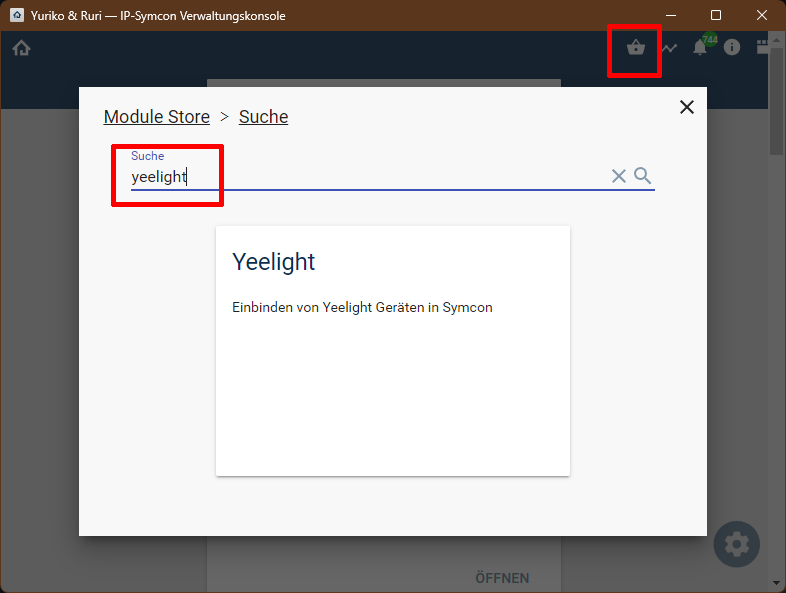
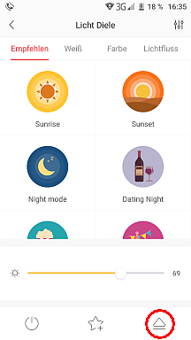
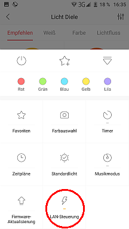
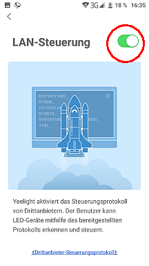

  

   
  

# Symcon-Modul: Yeelight <!-- omit in toc -->

Einbinden von Yeelight Geräten in IPS.  

## Dokumentation <!-- omit in toc -->

**Inhaltsverzeichnis**

- [1. Funktionsumfang](#1-funktionsumfang)
  - [Yeelight Discovery:](#yeelight-discovery)
  - [Yeelight Gerät:](#yeelight-gerät)
- [2. Voraussetzungen](#2-voraussetzungen)
- [3. Software-Installation](#3-software-installation)
- [4. Einrichten der Instanzen in IP-Symcon](#4-einrichten-der-instanzen-in-ip-symcon)
- [5. Anhang](#5-anhang)
  - [1. GUID der Module](#1-guid-der-module)
  - [2. Hinweise](#2-hinweise)
    - [1. LAN-Steuerung aktiveren](#1-lan-steuerung-aktiveren)
    - [2. Discovery-Instanzen erstellen](#2-discovery-instanzen-erstellen)
  - [3. Backlog](#3-backlog)
  - [4. Changelog](#4-changelog)
  - [4. Spenden](#4-spenden)
- [6. Lizenz](#6-lizenz)

## 1. Funktionsumfang

### [Yeelight Discovery:](YeelightDiscovery/)  

 - Auflisten alle im Netzwerk vorhandenen Yeelight Geräte.  
 - Erstellen von neuen Yeelight Device-Instanzen in IPS.  
 - **Funktioniert nicht in einem Docker Container welcher per NAT angebunden ist**

### [Yeelight Gerät:](YeelightDevice/)  

 - Empfangen und visualisieren der aktuellen Zustände in IPS.  
 - Steuerung per WebFront und per PHP-Funktionen. 
 - **Benötigt bei NAT eine Portweiterleitung von Port 1983 UDP ankommend** 

## 2. Voraussetzungen

 - IPS 6.1 oder höher  
 - Yeelight Gerät ( '3th party local control' muss aktiviert werden, siehe [hier](#1-lan-steuerung-aktiveren)   

## 3. Software-Installation

  Über den 'Module-Store' in IPS das Modul 'Yeelight' hinzufügen.  
   **Bei kommerzieller Nutzung (z.B. als Errichter oder Integrator) wenden Sie sich bitte an den Autor.**  
 

## 4. Einrichten der Instanzen in IP-Symcon

Die [Discovery Instanz](YeelightDiscovery/) wird nach der Installation aus dem Store automatisch angelegt(* [siehe Hinweise](#2-discovery-instanzen-erstellen)) und ermöglicht das einfache einbinden aller Geräte in IPS.  

Eine manuelle Einrichtung der Geräte ist in der [Yeelight Geräte Instanz](YeelightDevice/) beschrieben.  

## 5. Anhang

###  1. GUID der Module

 
|       Modul        |    Typ    |  Prefix  |                  GUID                  |
| :----------------: | :-------: | :------: | :------------------------------------: |
| Yeelight Discovery | Discovery | YeeLight | {7AABB3D2-3D24-4F2C-86CE-A56FB09D188A} |
|  Yeelight Device   |  Device   | YeeLight | {BF5D53BB-EB4E-45C0-8632-5DB4EF49FA9F} |

### 2. Hinweise  

#### 1. LAN-Steuerung aktiveren  

Nachdem die Geräte mit der Hersteller APP (Yeelight, nicht Xiaomi !) in das Netzwerk integriert wurden, muss die lokale Steuerung für jedes Gerät einzeln aktiviert werden.  
Aktuelle Versionen der App fragen dies automatisch nach dem hinzufügen der Geräte ab, da dieses Protokoll auch für die lokale Google Home Anbindung benötigt wird.

  

#### 2. Discovery-Instanzen erstellen  

Nach der Installation über den 'Modul-Store' fragt Symcon ob die enthaltende [Discovery Instanz](YeelightDiscovery/) erstellt werden soll.  
Wird Symcon allerdings unter Docker mit aktivem NAT betrieben, so kann diese Frage verneint werden.  
Die [Yeelight Geräte Instanzen](YeelightDevice/) müssen in dieser Konstellation per Hand angelegt und konfiguriert werden.  

### 3. Backlog

 - Aktionen und PHP-Befehle um Farbtemperatur und Helligkeit mir rotation durchschalten (Main und Hintergrund).  
 - Aktionen und PHP-Befehle um Farbe(HSV), Farbtemperatur und Helligkeit prozentual zu erhöhen oder zu verringern (Main und Hintergrund).  
 - Dokumentation der PHP-Befehlsreferenz vervollständigen.  

### 4. Changelog  

Version 2.11:
 - Version für IPS 7.0  

Version 2.10:
 - Quata exceeded Fehlermeldungen lösen einen automatischen Reconnect aus.  

Version 2.00:
 - Betrieb der Geräte-Instanzen auch mit NAT (z.B. Docker) möglich.  
 - VariablenProfile werden beim löschen mit entfernt.  
 - Aktionen (inkl. Programmablauf) werden unterstützt.
 - Debugausgaben waren unvollständig.  
 - Fehlermeldungen von Geräten wurden nicht berücksichtigt.  
 - Bessere Hinweise wenn es Probleme mit der Kommunikation gibt.  
 - RGB Farbwahl war defekt.  
 - UDP Kommunikation wird in Symcon ankommend auf Port 1983 erwartet. 
 - **Prefix für PHP-Befehle wurde auf "YEELIGHT" geändert.**  
 - **IPS 6.1 wird benötigt.**  

Version 1.80:  
 - Unnötigen Code aus Discovery entfernt.  
 - Discovery zeigt eine Meldung an, wenn keine Geräte gefunden wurden.  
  
Version 1.70:  
 - YEELIGHT_SetMode schaltet Gerät immer an.  
 - Zweites Profil für die Farbtemperatur bei Modus 'Weiß mit Nachtlicht'.  

Version 1.60:  
 - Erweiterung für den Nachtlicht-Modus  

Version 1.50:  
 - Release für IPS 5.1 und den Module-Store  

Version 1.00:  
 - Erstes offizielles Release  

### 4. Spenden  
  
  Die Library ist für die nicht kommerzielle Nutzung kostenlos, Schenkungen als Unterstützung für den Autor werden hier akzeptiert:  

## 6. Lizenz

  IPS-Modul:  
  [CC BY-NC-SA 4.0](https://creativecommons.org/licenses/by-nc-sa/4.0/)  
 
