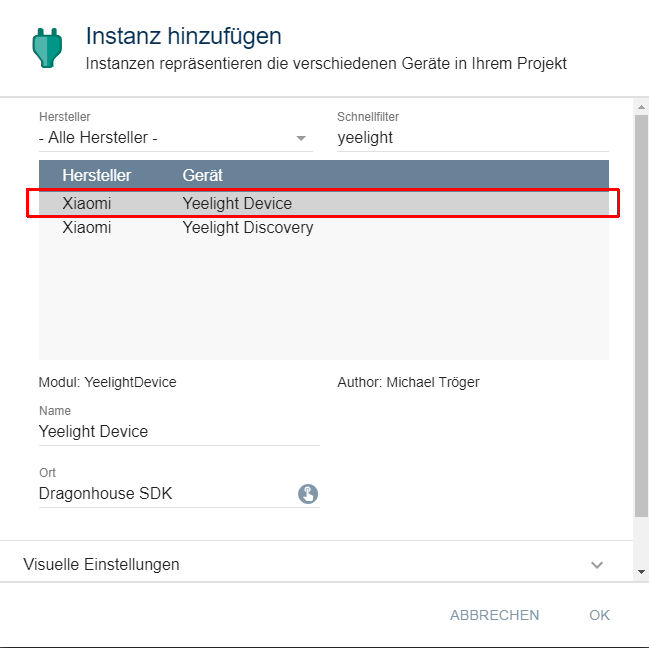

[](https://www.symcon.de/service/dokumentation/entwicklerbereich/sdk-tools/sdk-php/)
[]()
[](https://creativecommons.org/licenses/by-nc-sa/4.0/)  
[](https://www.symcon.de/forum/threads/30857-IP-Symcon-5-1-%28Stable%29-Changelog)
[](https://styleci.io/repos/186269467)  

# Yeelight Device
Einbindung eines Yeelight-Gerätes in IPS.  

## Dokumentation

**Inhaltsverzeichnis**

1. [Funktionsumfang](#1-funktionsumfang)  
2. [Voraussetzungen](#2-voraussetzungen)  
3. [Software-Installation](#3-software-installation) 
4. [Einrichten der Instanzen in IP-Symcon](#4-einrichten-der-instanzen-in-ip-symcon)
5. [Statusvariablen und Profile](#5-statusvariablen-und-profile)
6. [WebFront](#6-webfront)
7. [PHP-Befehlsreferenz](#7-php-befehlsreferenz) 
8. [Anhang](#8-anhang)  
9. [Lizenz](#9-lizenz)

## 1. Funktionsumfang

 - Empfangen und visualisieren der aktuellen Zustände in IPS.  
 - Steuerung per WebFront und per PHP-Funktionen.  

## 2. Voraussetzungen

 - IPS 5.1 oder höher  
 - Yeelight Gerät ( '3th party local control' muss aktiviert werden, siehe [hier](../#2-hinweise)  

## 3. Software-Installation

 Dieses Modul ist Bestandteil der [IPSYeelight-Library](../).  

**IPS 5.1:**  
   Bei privater Nutzung:
     Über den 'Module-Store' in IPS.  
   **Bei kommerzieller Nutzung (z.B. als Errichter oder Integrator) wenden Sie sich bitte an den Autor.**  

## 4. Einrichten der Instanzen in IP-Symcon

Das Anlegen von neuen Instanzen kann komfortabel über die Instanz [Yeelight Discovery:](../YeelightDiscovery/) erfolgen.  

Alternativ ist das Modul im Dialog 'Instanz hinzufügen' unter dem Hersteller 'Xaiomi' oder dem Schnellfilter 'Yeelight' zufinden.  
  

Es wird automatisch eine 'Client Socket' Instanz erzeugt.  
Erscheint im dem sich öffnenden Konfigurationsformular der Hinweis 'Eine übergeordnete Instanz ist inaktiv', so ist zuerst der 'Client Socket' zu konfigurieren.  
Diese Instanz kann über die Schaltfläche 'Gateway konfigurieren' erreicht werden.  
Werden Geräte über die [Discovery Instanz](../YeelightDiscovery/) erstellt, so wird der 'Client Socket' automatisch konfiguriert.  
Im 'Client Socket' muss die IP-Adresse des Gerätes und üblichweise der Port 55443 eingestellt werden.  

Folgende Parameter sind in der 'Yeelight Device' Instanz zu konfigurieren:  
  
**Konfigurationsseite:**  

| Eigenschaft       | Typ     | Standardwert | Funktion                                                                            |
| :---------------: | :-----: | :----------: | :---------------------------------------------------------------------------------: |
| SetSmooth         | bool    | false        | Bei true wird immer eine Transitionzeit von 500ms bei Ansteuerung gesetzt           |
| HUESlider         | bool    | true         | Aktiviert zwei Variablen für das WebFront welche einen HUE und Sat Slider enthalten |

## 5. Statusvariablen und Profile

Folgende Statusvariablen werden automatisch angelegt, je nach Gerät können es auch weniger sein.  

| Name                       | Typ     | Ident      | Beschreibung                                   |
| :------------------------: | :-----: | :--------: | :--------------------------------------------: |
| Status                     | bool    | power      | Status des Gerätes                             |
| Helligkeit                 | integer | bright     | Helligkeit in Prozent                          |
| RGB Farbe                  | integer | rgb        | RGB Farbwert                                   |
| Weiß                       | integer | ct         | Weißton im Modus 'Weiß'  von 1700K bis 6500K   |
| Aktueller Modus            | integer | color_mode | 1 = RGB, 2 = Weiß, 3 = HSV                     |
| HSV Sättigung              | integer | sat        | Sättigung in Prozent für HUE                   |
| HSV Hue                    | string  | hue        | JavaScript für den HUE-Slider im WebFront      |

**Profile**:

| Name               | Typ     | verwendet von Statusvariablen |
| :----------------: | :-----: | :---------------------------: |
| Yeelight.WhiteTemp | integer | Weiß                          |
| Yeelight.Mode      | integer | Aktueller Modus               |

## 6. WebFront

Die direkte Darstellung und Steuerung im WebFront ist möglich.  
  


## 7. PHP-Befehlsreferenz

Für alle 'bool' Rückgabewerte gilt:  
Wurde der Befehl erfolgreich ausgeführt, wird `true` zurück gegeben.  
Im Fehlerfall wird eine Warnung erzeugt und `false`zurück gegeben.  

Verfügt das Gerät über eine zweites 'Leuchtmittel' bzw. über eine Hintergrundfarbe,  
so stehen fast alle Befehle hierzu ebenfalls zur Verfügung.  
Da die Verwendung identisch ist, sind diese nicht weiter dokumentiert.  
Die Befehle lauten z.B.  
  'YeeLight_SetPower' => 'YeeLight_SetBgPower'  
  'YeeLight_SetWhiteSmooth' => 'YeeLight_SetBgWhiteSmooth'  
  'YeeLight_SetHSV' => 'YeeLight_SetBgHSV'  
usw...  

```php
bool YeeLight_RequestState(integer $InstanzID)
```
Liest den Zustand des Gerätes und führt alle Statusvariablen nach.  

```php
bool YeeLight_SetWhite(integer $InstanzID, integer $Temperature)
```
Setzt den in '$Temperature' übergebenen Weißton.  
Erlaubter Wertebereich ist 1700 bis 6500.  

```php
bool YeeLight_SetWhiteSmooth(integer $InstanzID, integer $Temperature, integer $Duration)
```
Setzt den in '$Temperature' übergebenen Weißton mit der in '$Duration' übergebenen Transitionzeit in Millisekunden.  
Erlaubter Wertebereich ist 1700 bis 6500.  

```php
bool YeeLight_SetRGB(integer $InstanzID, integer $Red, integer $Green, integer $Blue)
```
Setzt die in '$Red', '$Green' und '$Blue' übergebenen Farben.  
Erlaubter Wertebereich ist 0 bis 255.  

```php
bool YeeLight_SetRGBSmooth(integer $InstanzID, integer $Red, integer $Green, integer $Blue, integer $Duration)
```
Setzt die in '$Red', '$Green' und '$Blue' übergebenen Farben mit der in '$Duration' übergebenen Transitionzeit in Millisekunden.  
Erlaubter Wertebereich ist 0 bis 255.  

```php
bool YeeLight_SetHSV(integer $InstanzID, integer $HUE, integer $Saturation)
```
Setzt die in '$HUE' und '$Saturation' übergebene Farbe.  
Erlaubter Wertebereich ist für '$HUE' von 0 bis 359 und für '$Saturation' 1 bis 100.  

```php
bool YeeLight_SetHSVSmooth(integer $InstanzID, integer $HUE, integer $Saturation, integer $Duration)
```
Setzt die in '$HUE' und '$Saturation' übergebene Farbe mit der in '$Duration' übergebenen Transitionzeit in Millisekunden.  
Erlaubter Wertebereich ist für '$HUE' von 0 bis 359 und für '$Saturation' 1 bis 100.  

```php
bool YeeLight_SetBrightness(integer $InstanzID, integer $Level)
```
Setzt die in '$Level' übergebene Helligkeit.  
Erlaubter Wertebereich ist 0 bis 100.  

```php
bool YeeLight_SetBrightnessSmooth(integer $InstanzID, integer $Level, integer $Duration)
```
Setzt die in '$Level' übergebene Helligkeit mit der in '$Duration' übergebenen Transitionzeit in Millisekunden.  
Erlaubter Wertebereich ist 0 bis 100.  

```php
bool YeeLight_SetPower(integer $InstanzID, bool $Value)
```
Schaltet das Gerät ein oder aus.  
Erlaubte Werte für '$Value' sind 'true' zum ein- und 'false' zum ausschalten.  

```php
bool YeeLight_SetPowerSmooth(integer $InstanzID, bool $Value, integer $Duration)
```
Schaltet das Gerät ein oder aus, mit der in '$Duration' übergebenen Transitionzeit in Millisekunden.  
Erlaubte Werte für '$Value' sind 'true' zum ein- und 'false' zum ausschalten.  

```php
bool YeeLight_SetToogle(integer $InstanzID)
```

```php
bool YeeLight_SetToogleBoth(integer $InstanzID)
```

```php
bool YeeLight_SetDefault(integer $InstanzID)
```

```php
bool YeeLight_StartColorFlow(integer $InstanzID, integer $Loops, integer $RecoverState, string $Flow)
```

```php
bool YeeLight_StopColorFlow(integer $InstanzID)
```

```php
bool YeeLight_SetSleep(integer $InstanzID, integer $Minutes)
```

```php
integer YeeLight_GetSleep(integer $InstanzID)
```

```php
bool YeeLight_DelSleep(integer $InstanzID)
```

```php
bool YeeLight_IncreaseBright(integer $InstanzID)
```

```php
bool YeeLight_DecreaseBright(integer $InstanzID)
```

```php
bool YeeLight_IncreaseWhiteTemp(integer $InstanzID)
```

```php
bool YeeLight_DecreaseWhiteTemp(integer $InstanzID)
```

```php
bool YeeLight_CircleColor(integer $InstanzID)
```

```php
bool YeeLight_SetName(integer $InstanzID, string $Name)
```

## 8. Anhang

**Changlog:**  

Version 1.5:  
 - Release für IPS 5.1 und den Module-Store  

Version 1.0:  
 - Erstes offizielles Release  

## 9. Lizenz

  IPS-Modul:  
  [CC BY-NC-SA 4.0](https://creativecommons.org/licenses/by-nc-sa/4.0/)  
