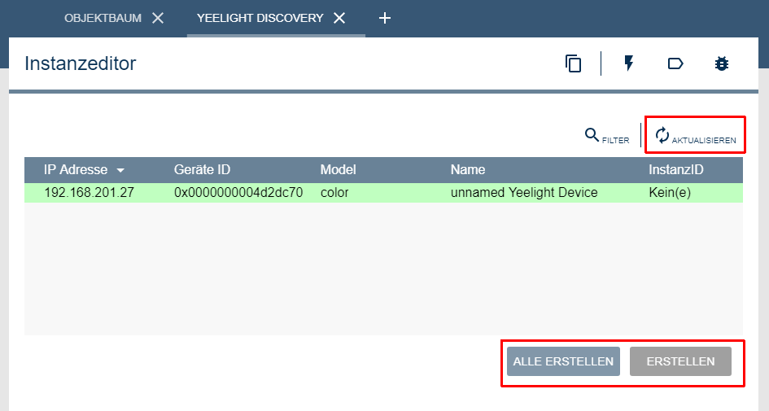

  

  

# Yeelight Discovery  
Sucht Yeelight Geräte im LAN und vereinfacht das Anlegen von Geräten in IPS.  

## Dokumentation

**Inhaltsverzeichnis**

1. [Funktionsumfang](#1-funktionsumfang)  
2. [Voraussetzungen](#2-voraussetzungen)  
3. [Software-Installation](#3-software-installation) 
4. [Einrichten der Instanzen in IP-Symcon](#4-einrichten-der-instanzen-in-ip-symcon)
5. [Statusvariablen und Profile](#5-statusvariablen-und-profile)
6. [WebFront](#6-webfront)
7. [PHP-Befehlsreferenz](#7-php-befehlsreferenz) 
8. [Anhang](#8-anhang)  
9. [Lizenz](#9-lizenz)

## 1. Funktionsumfang

 - Auflisten alle im Netzwerk vorhandenen Yeelight Geräte.  
 - Erstellen von neuen Yeelight Device-Instanzen in IPS.  

## 2. Voraussetzungen

 - IPS 5.1 oder höher  
 - Yeelight Gerät ( '3th party local control' muss aktiviert werden, siehe [hier](../#2-hinweise)  

## 3. Software-Installation

 Dieses Modul ist Bestandteil der [IPSYeelight-Library](../).  

**IPS 5.1:**  
   Bei privater Nutzung:
     Über den 'Module-Store' in IPS.  
   **Bei kommerzieller Nutzung (z.B. als Errichter oder Integrator) wenden Sie sich bitte an den Autor.**  

## 4. Einrichten der Instanzen in IP-Symcon

Das Modul ist direkt im Objektbaum unter den Discovery Instanzen zu finden.  

Beim öffnen der Discovery Instanz oder nach dem betätigen der Schaltfläche 'Aktualisieren', dauert es wenige Sekunden bis alle im Netzwerk gefunden Geräte angezeigt werden.  
Über das selektieren eines Eintrages in der Tabelle und betätigen des dazugehörigen 'Erstellen' Button,  können einzelne Instanzen in IPS angelegt werden.  
Alternativ können auch alle fehlenden Instanzen auf einmal erstellt werden.  
Erstelle Instanzen werden direkt im root des logischen Baums erstellt.  
  

Diese Instanz wird immer automatisch neu erstellt.  

## 5. Statusvariablen und Profile

Die Instanz besitzt keine Statusvariablen und Variablenprofile.  

## 6. WebFront

Die Instanz besitzt keine im WebFront darstellbaren Elemente.  

## 7. PHP-Befehlsreferenz

Die Instanz besitzt keine Instanz-Funktionen.  

## 8. Anhang

**Changlog:**  

Version 1.5:  
 - Release für IPS 5.1 und den Module-Store  

Version 1.0:  
 - Erstes offizielles Release  

## 9. Lizenz

  IPS-Modul:  
  [CC BY-NC-SA 4.0](https://creativecommons.org/licenses/by-nc-sa/4.0/)  
